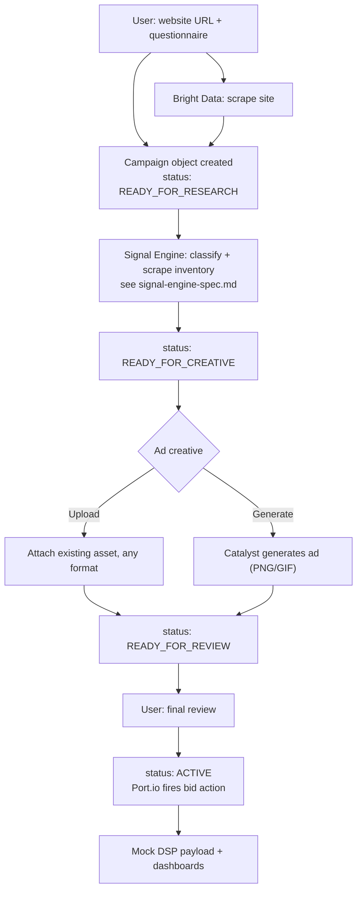

# Catalyst — Product Requirements Document (v3)

**One-liner:** A business submits a campaign — product, offer, audience, budget, dates — Catalyst researches where to advertise, gets creative attached (uploaded or generated), and on final approval Port.io moves the campaign live. Four steps, one state machine.

**Supersedes:** the questionnaire section of `scout-v2-prd.md` and all of `catalyst-onboarding-questionnaire.md`. The Signal Engine's internal mechanics (`signal-engine-spec.md` — IAB classification, channel affinity scoring, Bright Data scraping) are unchanged and referenced, not restated, below.

---

## What changed from v2

v2's onboarding asked ~12 structured questions upfront (age-range checkboxes, interest taxonomy multi-select, budget tier) to give the classifier a head start. v3 trades that precision for speed: a 7-field campaign brief, plus whatever the website scrape can infer. The bet is that free-text `offer_summary` + `target_audience`, fed through the same classification pipeline, is good enough — and if it isn't, that's what the market research step and the final human review exist to catch, not something to over-engineer at intake.

Campaign state now lives in Port.io as the system of record, not just an audit log. `status` on the campaign object drives the whole pipeline — each of the four steps is a state transition, not a separate flow.

---

## Locked assumptions

1. `campaign_id` and `status` are system-generated, never user-facing form fields.
2. Ad creative generation is constrained to PNG or GIF only for v3 — no video. Even a single well-composed static PNG is a complete, demoable outcome; GIF support is a stretch if time allows.
3. "Port starts bidding" still means the mocked DSP payload push from v2 — no real spend, no live Trade Desk/DV360 API access. Nothing here changes that non-goal.
4. Dashboards = the SigNoz trace view (technical/pipeline) plus a lightweight Port.io catalog view of campaign status (non-technical, business-owner-facing).

---

## The flow



Every arrow above is a SigNoz span. Every state change is a Port.io event on the campaign catalog entity.

---

## Step 1 — Intake

### Questionnaire (built from the campaign schema)

| Field | Question | Type | Required |
|---|---|---|---|
| `product_name` | What's the product or company name? | Text | Yes |
| `product_url` | Website | URL | Yes — triggers the Bright Data scrape |
| `offer_summary` | In one sentence, what are you offering? | Text | Yes |
| `target_audience` | Who is this for? | Text | Yes |
| `campaign_goal` | What's the goal? | Single-select: Free-trial signups / Drive sales / App installs / Brand awareness / Event or launch promotion / Other | Yes |
| `maximum_spend_usd` | Maximum campaign spend | Number (USD) | Yes |
| `publication_window_start` / `_end` | Campaign dates | Date range | Yes |

Seven fields, most of them one line each. If the scrape can infer `offer_summary` or product details from the site, pre-fill and let the user confirm rather than retype.

### On submit

```json
{
  "campaign_id": "generated-by-port",
  "product_name": "Acme AI",
  "product_url": "https://acme.ai",
  "offer_summary": "AI code review for development teams",
  "target_audience": "Professional software developers",
  "campaign_goal": "Free-trial signups",
  "maximum_spend_usd": 2500,
  "publication_window_start": "2026-09-01",
  "publication_window_end": "2026-09-30",
  "status": "READY_FOR_RESEARCH"
}
```

Port.io creates this as a catalog entity the instant the form submits. Everything downstream reads and writes to this same object.

---

## Step 2 — Market research

Fires automatically on `status: READY_FOR_RESEARCH`. This is the Signal Engine, unchanged: `offer_summary` + `target_audience` (+ scraped site content, if a URL was given) go through IAB classification, deterministic channel-affinity scoring, then Bright Data pulls live rate-card data for the matched channels. Full mechanics in `signal-engine-spec.md` — not re-derived here.

Output appends `channel_signals` (the Bid Signal array from the earlier spec) to the campaign object and advances `status` to `READY_FOR_CREATIVE`.

---

## Step 3 — Creative

Fires on `status: READY_FOR_CREATIVE`. Two paths:

- **Upload** — user attaches an existing asset, any format. Stored, linked to the campaign, no transformation needed.
- **Generate ("catalyze one")** — constrained to PNG or GIF. Prompted with `offer_summary`, `target_audience`, and the top-ranked channel from Step 2's `channel_signals` (so the creative direction matches where it's actually going to run — a Twitch-targeted asset can look different from a LinkedIn-targeted one). GIF, if built, is a simple looping animation, not full motion — scope it down before scoping it out.

Either path appends `creative_asset_url` and `creative_format` to the campaign object and advances `status` to `READY_FOR_REVIEW`.

---

## Step 4 — Review, bid, dashboard

`READY_FOR_REVIEW` surfaces the full assembled campaign — offer, audience read, ranked channels with CPM benchmarks, creative preview, budget, dates — as one screen. This is the only mandatory human checkpoint in the whole flow; nothing spends or commits before it.

On approval: Port.io fires the bid action, `status` moves to `ACTIVE`, and the mock DSP payload is generated exactly as in v2. Two dashboards follow:

- **SigNoz** — full pipeline trace, every span from form submission to bid push, for anyone auditing how a recommendation was reached.
- **Port.io catalog view** — plain-language campaign status for the business owner: what stage it's in, what channels were picked, what's spending against what budget.

---

## Acceptance criteria

- [ ] Given the 7-field form is submitted, then a Port.io campaign entity is created matching the schema, with `status: READY_FOR_RESEARCH`.
- [ ] Given a `product_url` was provided, when the scrape completes, then `offer_summary` and related fields are pre-filled before the user sees the form.
- [ ] Given `status: READY_FOR_RESEARCH`, when the Signal Engine completes, then `channel_signals` is populated and `status` advances to `READY_FOR_CREATIVE`.
- [ ] Given `status: READY_FOR_CREATIVE`, when the user either uploads or generates creative, then `creative_asset_url` is set and `status` advances to `READY_FOR_REVIEW`.
- [ ] Given `status: READY_FOR_REVIEW`, when the user approves, then `status` advances to `ACTIVE`, a mock DSP payload is produced, and a SigNoz trace covering all four steps is viewable end to end.
- [ ] Given creative generation is requested, then output format is restricted to PNG or GIF — no other format is offered.

---

## Build order (v3 delta from v2)

1. Campaign schema + Port.io catalog entity with the four-state machine — this is the spine everything else attaches to.
2. Step 1 form + Bright Data pre-fill.
3. Wire Step 2 (Signal Engine — already specced, mostly a matter of triggering it off `status` and writing `channel_signals` back).
4. Step 3 creative: upload path first (trivial), generation path second (image model call, PNG only — GIF only if time remains).
5. Step 4 review screen + Port.io bid action + SigNoz dashboard assembly.
6. Demo run end to end, cache a known-good fallback, README, video.
